# inittest.cpp

测试默认初始化

all		 全局变量：默认初始化为0.

main	使用{}进行初始化：初始化为0.

fun	   函数内的局部变量：未定义

class	类的成员变量的默认初始化：未定义

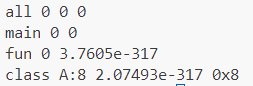


# move.cpp

测试移动拷贝构造函数  的默认行为

// test1:  不写，因为定义了拷贝构造，移动语义会变成拷贝构造。

// test2: 声明为delete   调用move时会编译出错。

​	// MyClass(MyClass&& other) =delete;   

// test3: 声明为default

​	// MyClass(MyClass&& other) =default;   

// test4: 自己声明

  //   data = other.data;

  //   *data+=100;

  //   other.data = nullptr;

  //   std::cout << "Move Constructor called, value: " << *data << std::endl;

  // }

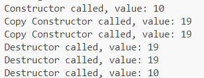


# smart_ptr.cpp

测试unique指针的拷贝（移动）

// std::unique_ptr<MyClass> ptr2 = ptr1; // This line would cause a compile error

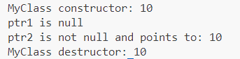


# reference.cpp

测试引用的参数传递

补充：返回的时候因为编译器默认了返回值优化，所以不会调用拷贝构造或移动拷贝构造。


此外还测试了 new 抛出的异常，会结束程序；但try catch 可以保持程序继续运行。

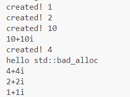


# bool.cpp

vector<bool>会有一些问题

这里用vector<char>进行代替，验证了输出时可以完成char到bool的转换；

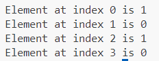


# namespace.cpp

测试了命名空间；可以多次定义补充定义。

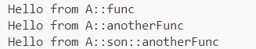


# test_move.cpp

测试了返回值优化；

测试了如果不使用移动拷贝，会转化为拷贝构造。


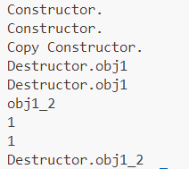


# type_trans.cpp

测试了类型转换过程中的warning。

默认是不会warning的，比如int转size_t、double转int；

这里会warning，是因为类型转换时使用了{},会强制执行类型检查。

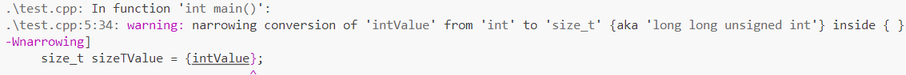


# vptr.cpp

测试了虚函数的大小

S是空类，占用1字节；

其他类都是有继承关系的有虚函数的A B C； 大小是一个虚指针的大小，所以是8字节；

T是纯虚函数，也是8B；

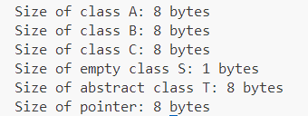


# virtual.cpp

测试纯虚函数、虚函数、非虚函数 继承的区别

A* obj = new B();

**纯虚函数：只继承接口**

obj->pureVirtualFunction();

**虚函数：继承接口和缺省实现**

obj->virtualFunction();

**非虚函数：继承接口和强制实现**

obj->nonVirtualFunction();

B* obj2 = new B();

obj2->nonVirtualFunction();

没有多态

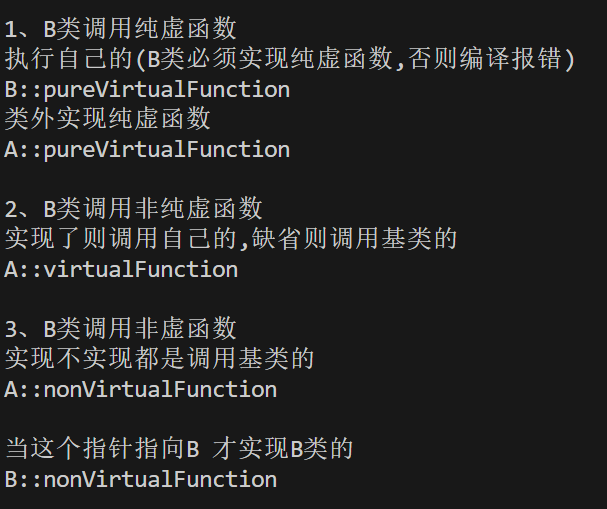


# CRTP.cpp

不用虚函数，实现了多态的功能。

这里是静态多态，需要在编译期间完成；

这里是直接创建子类的对象，而不是返回基类的指针；

  B b(2);

  C c;

通过静态重载handle实现不同的功能；

  handle(b); // Calls B's specific handle

  handle(c); // Calls C's specific handle


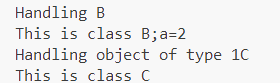


# typeCheck.cpp

由于CRTP不能实现动态多态，我又想通过handle实现多态；

通过如下**类型检查**实现

```c++
void handle(const A* obj) {
    if (typeid(*obj) == typeid(B)) {
        std::cout << "Handling B* (via A*)" << std::endl;
        obj->display();
    } else if (typeid(*obj) == typeid(C)) {
        std::cout << "Handling C* (via A*)" << std::endl;
        obj->display();
    } else {
        std::cout << "Handling A* (base)" << std::endl;
        obj->display();
    }
}
```


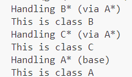


# factoryPattern.cpp

##### 1、简单工厂

只有唯一的工厂，create(type id) 通过if else判断调用哪个构造

##### 2、工厂方法

每个类对应一个工厂。

##### 2.1、模板工厂

通过模板省去写多个。

```c++
template <class B>
struct Fatory {
    static Peoson* create(int i) {
        return new B();
    } 
};
```

##### 3、抽象工厂

有多个生产函数，生产不同类别的东西；

createA();

createB();

##### 3.1 抽象模板工厂

多一个模板参数代表生产的不同类别。

```c++
template <class TBase,class TDerive>
struct Fatory {
    static Tbase* create() {
        return new TDrive();
    } 
};
```


### 手动分割线

这段代码是通过工厂模式消除if else判断；

维护一个工厂的map；根据typeid 从map中找对应的工厂，创建对象。

对比维护一个`ptr<Derive>`的map，这里的ptr是唯一的。不能生成多个。

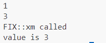 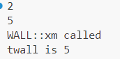

